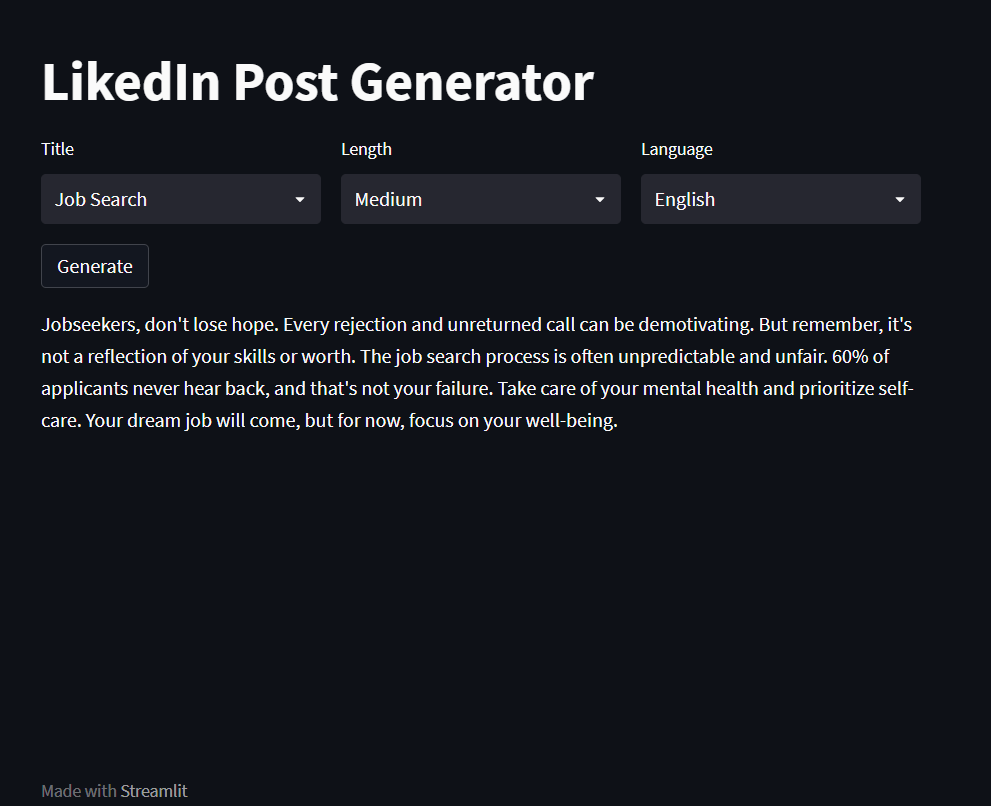

# LinkedIn_Post_Generator
Takes a topic, length and language to generate LinkedIn Post for it. Uses writing style from old posts and create a new posts on the basis of it and on a particular topic.



# Technical Architecture
1. Stage 1: To collect linkedin post in json format and extract valuable information and enrich it.
2. Stage 2: Use topic, language, and length to generate a new post.

# Set-up
1. Create an API-KEY from Groq. GROQ_API_KEY variable can be used.
2. Install all the requirements
```python
pip install -r requirements.txt
```
3. Run the streamlist app:
```
streamlit run main.py
```
